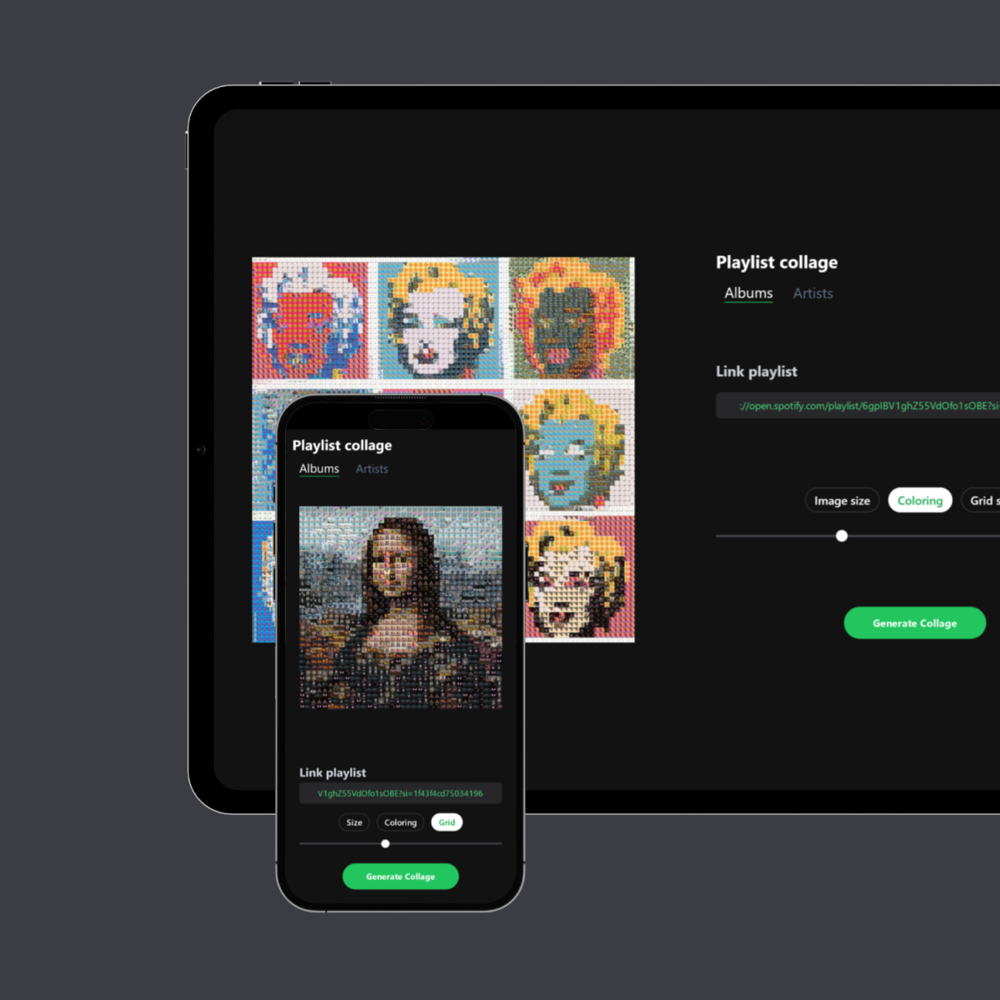

# [Playlist-Collage](https://playlist-collage.vercel.app/)

# Controls

- Size - changes resolution of saved collage
- Coloring - coloring of collage to match target image
- Grid - number of images in collage

# Libraries

- Typescript
- React / Next.js
- Tailwind.css
- [react-image-mosaic](https://github.com/thejsn/react-image-mosaic)
